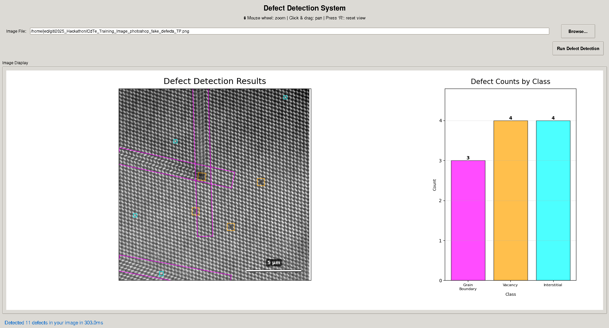

# Defect Detection System

A YOLOv11-based defect detection system for microscopy images of CdTe materials, featuring synthetic training data generation and an interactive GUI for inspection.

## Table of Contents

- [Installation](#installation)
- [Quick Start](#quick-start)
- [Generating Training Data](#generating-training-data)
- [Training the Model](#training-the-model)
- [Running Defect Detection](#running-defect-detection)
- [Using the GUI](#using-the-gui)

## Installation

### 1. Clone the Repository

```bash
git clone https://github.com/kingbedjed/Defect-Detector.git
cd Defect-Detector
```

### 2. Create Conda Environment

```bash
conda env create -f environment.yml
conda activate defect_detector
```

The environment includes:
- PyTorch with GPU support
- Ultralytics YOLOv11
- NumPy, SciPy, Pandas, Matplotlib
- Pillow, scikit-image
- Jupyter
- tqdm

## Quick Start

```bash
# 1. Generate training data
python generate_training_all_data.py

# 2. Train the model (or use Jupyter notebook)
jupyter notebook yolov11_obb_train.ipynb

# 3. Run the GUI
python defect_detection_gui.py
```

## Generating Training Data

The system uses synthetic data to train the defect detection model. Run the data generation script to create training and validation datasets:

```bash
python generate_training_all_data.py
```

### What It Does

- Generates synthetic STEM microscopy images with defects
- Creates 20 base images with different random seeds
- Applies data augmentation (rotations: 0°, 90°, 180°, 270° and reflections)
- Produces ~320 total images (256 training, 64 validation)
- Generates oriented bounding boxes in YOLO format
- Creates three defect classes:
  - Class 0: Grain boundaries
  - Class 1: Vacancies
  - Class 2: Interstitials

### Output Structure

```
training_data/
├── training_data.yaml          # YOLO configuration file
├── images/
│   ├── train/                  # Training images (80%)
│   └── validation/             # Validation images (20%)
└── labels/
    ├── train/                  # Training labels (YOLO OBB format)
    └── validation/             # Validation labels
```

### Configuration

Edit parameters in `generate_training_all_data.py`:
- `img_size`: Image dimensions (default: 768×768)
- `num_seeds`: Number of base images (default: 20)
- `training_split`: Train/validation ratio (default: 0.8)

## Training the Model

### Option 1: Using Jupyter Notebook (Recommended)

```bash
jupyter notebook yolov11_obb_train.ipynb
```

Run all cells to:
1. Load the YOLOv11-OBB pretrained model
2. Train on your generated data
3. Save the trained model to `runs/obb/train/weights/best.pt`

### Option 2: Training Script

The notebook contains this core training code:

```python
from ultralytics import YOLO
from pathlib import Path

# Load pretrained model
model = YOLO("yolo11n-obb.yaml").load("yolo11n.pt")

# Train the model
data = Path.cwd() / "training_data" / "training_data.yaml"
results = model.train(
    data=data,
    epochs=500,
    imgsz=768
)
```

### Training Parameters

- **Model**: YOLOv11n-OBB (oriented bounding boxes)
- **Epochs**: 500 (adjust based on convergence)
- **Image Size**: 768×768
- **Data**: Synthetic defect images

### Model Output

Trained models are saved to:
```
runs/obb/train/
└── weights/
    ├── best.pt       # Best model (recommended)
    └── last.pt       # Last epoch model
```

Copy the best model to your project:
```bash
mkdir -p trained_models/yolov11_obb/model_1/weights
cp runs/obb/train/weights/best.pt trained_models/yolov11_obb/model_1/weights/
```

## Running Defect Detection

### Command Line Interface

Run defect detection on a single image:

```bash
# Use default model
python main.py <path_to_image>

# Use custom model
python main.py <path_to_image> <model_path>
```

**Example:**
```bash
python main.py CdTe_Training_Image_photoshop_fake_defects_TP.png
```

### Python API

Use the defect detection function in your own code:

```python
from main import load_images, find_defects_yolo
from ultralytics import YOLO

# Load model
model = YOLO("trained_models/yolov11_obb/model_1/weights/best.pt")

# Load image
image = load_images("path/to/image.tif")

# Run detection
bboxes = find_defects_yolo(model, image)

# bboxes format: [(class_id, x1, y1, x2, y2, x3, y3, x4, y4), ...]
```

### Output Format

Bounding boxes are returned as tuples:
```python
(class_id, x1, y1, x2, y2, x3, y3, x4, y4)
```

Where:
- `class_id`: Defect class (0=grain_boundary, 1=vacancy, 2=interstitial)
- `(x1, y1)` to `(x4, y4)`: Four corner points of the oriented bounding box

## Using the GUI

Launch the graphical interface for interactive defect detection and inspection:

```bash
python defect_detection_gui.py
```


### Command Line Options

```bash
# Standard mode
python defect_detection_gui.py

# Debug mode (load ground truth labels)
python defect_detection_gui.py --debug

# Custom model path
python defect_detection_gui.py --model path/to/model.pt

# Custom pixel width for scale bar (default: 22.8 nm)
python defect_detection_gui.py --pixel-width 20.0

# Combined options
python defect_detection_gui.py --debug --model path/to/model.pt --pixel-width 22.8
```

### GUI Features

- **Load Images**: Browse and open .tif, .png, .jpg files
- **YOLO Detection**: One-click defect analysis with YOLOv11-OBB
- **Interactive Zoom**: Mouse wheel to zoom in/out (0.1x to 100x+)
- **Pan Navigation**: Click-and-drag to explore the image
- **Dynamic Scale Bar**: Automatically adjusts with zoom level, showing nm, µm, or mm
- **Visual Overlay**: Color-coded bounding boxes for each defect class:
  - Red: Grain boundaries
  - Blue: Vacancies
  - Green: Interstitials
- **Defect Statistics**: Bar chart showing class distribution
- **Performance Metrics**: Detection time in milliseconds

### Controls

| Action | Control |
|--------|---------|
| **Zoom In** | Scroll wheel up |
| **Zoom Out** | Scroll wheel down |
| **Pan** | Left-click + drag |
| **Reset View** | Press 'R' or 'r' |

### Basic Workflow

1. Click **"Browse..."** and select an image
2. Click **"Run Defect Detection"**
3. View results with colored bounding boxes
4. Use mouse wheel to zoom in on defects
5. Click and drag to pan around
6. Press 'R' to reset view

### Zoom Tips

| Zoom Level | Best For |
|------------|----------|
| 0.5x - 1.0x | Full image overview |
| 1.5x - 3x | Multiple defects, general scanning |
| 3x - 5x | Individual defect examination |
| 5x - 10x | Fine detail inspection |
| 10x - 20x | Pixel-level analysis |

### Scale Bar

The GUI displays a dynamic scale bar in the bottom-right corner that:
- Automatically updates when zooming or panning
- Displays appropriate units (nm, µm, or mm) based on zoom level
- Uses the pixel width specified with `--pixel-width` (default: 22.8 nm/pixel)
- Shows approximately 20% of the visible width for easy reference

**Setting Custom Pixel Width:**
```bash
# For images with different resolution
python defect_detection_gui.py --pixel-width 15.5
```

The scale bar helps you:
- Measure defect sizes at any zoom level
- Understand the physical scale of features
- Maintain spatial awareness while navigating

### Debug Mode

Enable debug mode to load ground truth bounding boxes for comparison:

```bash
python defect_detection_gui.py --debug
```

In debug mode, you can:
- Load `.txt` label files from `training_data/labels/`
- Compare model predictions with ground truth
- Verify training data quality

### Supported File Formats

- **TIFF**: .tif, .tiff (recommended for microscopy)
- **PNG**: .png
- **JPEG**: .jpg, .jpeg

**Note**: Grayscale images are automatically converted to 3-channel RGB for YOLO inference.

### GUI Troubleshooting

**Detection button disabled:**
- Load an image first using the Browse button

**Zoom not working:**
- Ensure cursor is over the image display area
- Click on the image to focus

**Pan not working:**
- Use left mouse button (not right or middle)
- Zoom in first for best panning experience

**No defects found:**
- Check model path is correct
- Verify model is properly trained
- Some images may genuinely have no defects

## Project Structure

```
2025_Hackathon/
├── main.py                          # CLI defect detection
├── defect_detection_gui.py          # GUI application
├── generate_training_all_data.py        # Synthetic data generation
├── generate_synthetic_training_data.py  # Data generation utilities
├── yolov11_obb_train.ipynb          # Model training notebook
├── yolov11_obb_inference.ipynb      # Inference examples
├── environment.yml                  # Conda environment
├── training_data/                   # Generated training data
│   ├── training_data.yaml
│   ├── images/
│   └── labels/
└── trained_models/                  # Saved YOLO models
    └── yolov11_obb/
        └── model_1/
            └── weights/
                └── best.pt
```

## Additional Notes

### Model Performance

- **Input**: 768×768 grayscale images (auto-converted to RGB)
- **Output**: Oriented bounding boxes with class predictions
- **Inference Speed**: ~10-50ms per image (GPU dependent)
- **Classes**: 3 defect types (grain boundaries, vacancies, interstitials)

### Model Path Configuration

Default model path:
```
trained_models/yolov11_obb/model_1/weights/best.pt
```

Override with:
- Command line: `python main.py image.tif custom/path/model.pt`
- GUI: `python defect_detection_gui.py --model custom/path/model.pt`
- Python API: `YOLO("custom/path/model.pt")`

---

**Quick Reference Card:**

| Task | Command |
|------|---------|
| Generate data | `python generate_training_all_data.py` |
| Train model | `jupyter notebook yolov11_obb_train.ipynb` |
| CLI detection | `python main.py image.tif` |
| Launch GUI | `python defect_detection_gui.py` |
| Zoom in | Scroll up |
| Zoom out | Scroll down |
| Pan | Click + drag |
| Reset view | Press 'R' |
